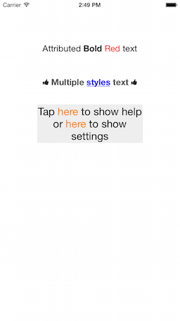

WPAttributedMarkup
==================

WPAttributedMarkup is a simple utility category that can be used to easily create an attributed string from text with markup tags and a style dictionary.

The category allows you to turn text such as:

    <bold>Bold</bold> text

into  "<b>Bold</b>" text by using a style dictionary such as:

      NSAttributedString *as = [@"<bold>Bold</bold" attributedStringWithStyleBook:@{@"body":[UIFont fontWithName:@"HelveticaNeue" size:18.0],
      @"bold":[UIFont fontWithName:@"HelveticaNeue-Bold" size:18.0]}];

In this example, the style associated with "body" is applied to the whole text, whereas the style associated with "bold" is applied to the text contained within < bold > tags.

All tags (with the exception of 'body') are user-defined.

The dictionary is called a 'style book' as the intention is for it to contain all of the application fonts, colours etc in a single place.

FAQ
---

Q. Can this convert html to styled text?

A. In general, no. The syntax is html-like, but all tags are user-defined. If the html is correctly formatted, and uses a strict set of tags, you could convert html to attributed text by defining an appropriate set of tags (b, h1, h2, etc).

Q. Doesn't NSAttributedString already convert html text using something like:

    [NSAttributedString alloc] initWithData:[htmlString dataUsingEncoding:NSUTF8StringEncoding] 
                                 options:@{NSDocumentTypeDocumentAttribute: NSHTMLTextDocumentType,
                                           NSCharacterEncodingDocumentAttribute: @(NSUTF8StringEncoding)} 
                      documentAttributes:nil error:nil];

A. It does. However, the above approach is very slow (it uses a WebView in the background) and runs asynchronously (just try creating one in a UITableViewCell and scroll the table too fast...).

In addition, any styles must be set in the document css, rather than being able to pass in standard colour and font classes that your application already uses.

What styles are supported?
--

The following objects can be used in the style dictionary:

<b>UIColor</b> : For colouring a section of text.

    @"red": [UIColor redColor]

<b>UIFont</b> : For setting the font for a section of text.

    @"bold":[UIFont fontWithName:@"HelveticaNeue-Bold" size:18.0]

<b>NSDictionary</b> : Applies an attributed string style key/pair to the section of text. This can be used for applying underline, strikethrough, paragraph styles, etc as well as custom attributes.

    @"u": @{NSUnderlineStyleAttributeName : @(kCTUnderlineStyleSingle|kCTUnderlinePatternSolid)}

<b>NSArray</b> : An array of any style items, all of which are applied to the section of text.

    @"u": @[[UIColor blueColor],
    @{NSUnderlineStyleAttributeName : @(kCTUnderlineStyleSingle|kCTUnderlinePatternSolid)} ]

<b>NSString</b> : Applies a named style to the section of text. Useful for applying an existing style in addition to some new attributes without needing to copy the existing attributes.

     @"red": [UIColor redColor],
     @"redunderline": @[ @{NSUnderlineStyleAttributeName : @(kCTUnderlineStyleSingle|kCTUnderlinePatternSolid)}, @"red" ]

<b>UIImage</b> : Inserts the UIImage into the text at the section of text. Note: The text inside the image tags must contain only a single character, which will be replaced by the image. 

    @"thumb":[UIImage imageNamed:@"thumbIcon"]

 

Used in the text as:

     <thumb> </thumb>

Extras
--

Some extra utility classes are included which may also be of use in association with WPAttributedMarkup. In particular, the <b>WPHotspotLabel</b> class can be used to apply block methods to any part of the attributed string, allowing trivial application-specific links to be created.

<b>WPAttributedStyleAction</b> - A class which wraps a block and allows insertion into an attributed string using the <b>styledAction</b> method. This actually adds a <b>link</b> style to the text, so the text will also inherit the attributed defined in the <b>link</b> style, if defined.

This can be used as follows:

    @"help":[WPAttributedStyleAction styledActionWithAction:^{
                                 NSLog(@"Help action");
                             }]

<b>WPTappableLabel</b> - A simple UILabel subclass which allows an onTap block to be set, which is called when the label is tapped.

<b>WPHotspotLabel</b> - A subclass of WPTappableLabel which detects the attributes of the text at the tapped position, and executes the action if a WPAttributedStyleAction attribute is found.

Note that these classes have not been tested as exhaustively, so it is possible that these do not behave as expected under all conditions. In particular, WPHotspotLabel uses CoreText layout to detect the attributes of the tapped position, which could potentially result in different layout than the one being displayed. Under all tests so performed so far with simple labels and formatting, the detection does work correctly, but  you have been warned!

Example
--

    NSDictionary* style1 = @{@"body":[UIFont fontWithName:@"HelveticaNeue" size:18.0],
                             @"bold":[UIFont fontWithName:@"HelveticaNeue-Bold" size:18.0],
                             @"red": [UIColor redColor]};

     NSDictionary* style2 = @{@"body" :
                                 @[[UIFont fontWithName:@"HelveticaNeue-Bold" size:18.0],
                                   [UIColor darkGrayColor]],
                                @"u": @[[UIColor blueColor],
                                    @{NSUnderlineStyleAttributeName : @(kCTUnderlineStyleSingle|kCTUnderlinePatternSolid)}
                                     ],
                                @"thumb":[UIImage imageNamed:@"thumbIcon"] };

    NSDictionary* style3 = @{@"body":[UIFont fontWithName:@"HelveticaNeue" size:22.0],
                             @"help":[WPAttributedStyleAction styledActionWithAction:^{
                                 NSLog(@"Help action");
                             }],
                             @"settings":[WPAttributedStyleAction styledActionWithAction:^{
                                 NSLog(@"Settings action");
                             }],
                             @"link": [UIColor orangeColor]};

    self.label1.attributedText = [@"Attributed <bold>Bold</bold> <red>Red</red> text" attributedStringWithStyleBook:style1];

    self.label2.attributedText = [@"<thumb> </thumb> Multiple <u>styles</u> text <thumb> </thumb>" attributedStringWithStyleBook:style2];

    self.label3.attributedText = [@"Tap <help>here</help> to show help or <settings>here</settings> to show settings" attributedStringWithStyleBook:style3];

How it works
--

The utility consists of two categories:

<b>NSMutableString+TagReplace</b> : Used internally to strip all tags out of a NSMutableString, building an array of tags with start and end ranges.

<b>NSString+WPAttributedMarkup</b> : Contains a single public method:

    -(NSAttributedString*)attributedStringWithStyleBook:(NSDictionary*)styleBook;

This builds an arrange of tags using NSMutableString+TagReplace, then iterates through each of the tags and applies the styles found in the style book.

If no style is found for a tag, then the tag is simply stripped from the string with no style applied.

If the <b>body</b> tag is found in the style book, then this is applied to the entire string before any other styles are applied.

 